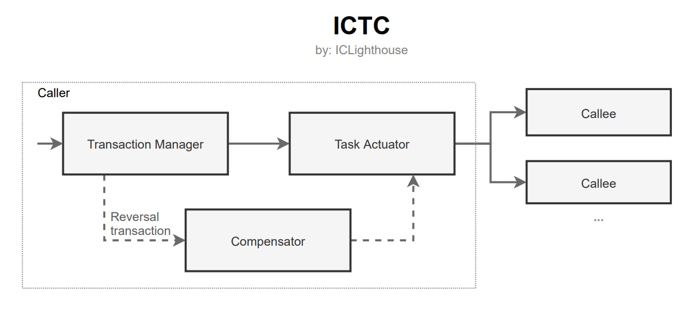
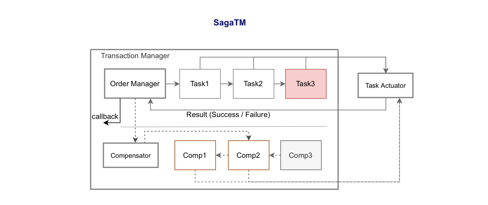
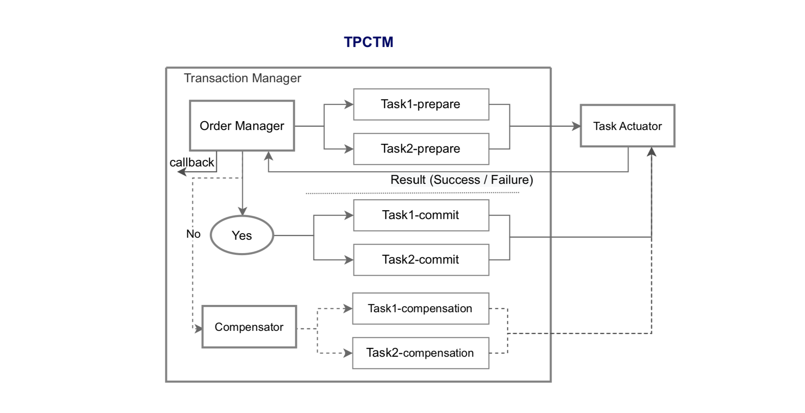

# ICTC 

## 概述

IC事务协调器（ICTC）是一个用于IC网络上Defi应用开发的分布式事务框架，支持Motoko开发语言。ICTC的核心思想是受到金融领域普遍使用的DTC (Distributed Transaction Coordinator)的启发.

## 解决什么问题

基于IC网络开发Dapp，特别是Defi应用，我们不得不面对原子性问题，这本质是一个分布式事务的数据一致性问题。与传统分布式事务相比，区块链网络上的分布式事务面临最大的挑战是，对参与主体的信任假设不同。传统分布式事务对参与主体是基于可信假设，而区块链网络上的分布式事务对参与主体是基于不可信假设，它只信任智能合约代码。

当Canister的一个方法需要执行跨容器调用，将面临被调用方(Callee)故障而导致数据不一致的威胁。可能出现的三种故障：

- 业务层错误 (business error): 如Token余额不足。
- 运行时错误 (runtime error): 如除以0错误。
- 子网宕机 (fail-stop): 如被调用方(Callee)容器所在子网不可访问。

IC网络在大部分时间中不会出现暂时性故障和子网宕机，但仍然存在发生这类故障的的可能性。如果Defi应用不能健壮地处理故障，保持数据最终一致性，后果可能是灾难性的。

所以我们需要一个新的框架，需要调用方和被调用方的共同努力，提供有利于分布式事务执行的特性。ICTC是基于[BASE理论](https://queue.acm.org/detail.cfm?id=1394128)，在跨容器事务中追求数据最终一致性。但遗憾的是，ICTC只能做到“最大努力交付”，还需要治理补偿或者手工补偿机制作为最后保障，才能实现最终一致性。

ICTC要求各参与方实现：

- 被调用方实现内部任务原子性
- 被调用方根据实际情况满足最终一致性的功能，包括：
    - 允许重试（要求实现幂等性）
    - 使用Nonce（保证交易有序执行，幂等性）
    - Txid全局唯一，并可预先计算（txid在发送交易前可得）
    - 提供冲正交易函数（回滚操作）
- 调用方采取多种方式实现最终一致性，包括：
    - 重试
    - 自动冲正
    - 治理或者手工冲正
- 先借后贷原则（先收后支，可冻结的先处理）
- 调用方主导原则（由调用方担任协调者）


## 技术架构

ICTC由事务管理器（Transaction Manager，TM）、任务执行器（Task Actuator，TA）、事务补偿器（Transaction Compensator，TC）组成。

事务订单（Transaction Order）：指一个具体的事务，包括一个或多个事务任务（Transaction Task），要求所有任务要么全部成功，要么全部拒绝。  
事务任务（Transaction Task）：指一个事务中的任务，包括调用者本地任务和其他参与方的远程任务。



## Task Actuator

Task Actuator使用“最大努力交付”（best-effort delivery）策略，并且肯定会返回结果（成功/失败）。


## Transaction Manager

Transaction Manager的作用是管理事务状态，操作Actuator，处理异常情况并调用Compensator。Transaction Manager分为Saga事务管理器（Saga Transaction Manager，SagaTM）和2PC事务管理器（2PC Transaction Manager，TPCTM）。

**Saga Transaction Manager**



**2PC Transaction Manager**



## Transaction Compensator

Transaction Compensator的功能在Transaction Manager中一起实现，其作用是当事务发生异常时执行补偿操作，包括自动补偿、治理或手工补偿。

## Roadmap

- ICTC Framework PoC Version  (done)
- Synchronous Actuator  (done)
- Saga Transaction Manager  (done)
- ICTC Framework Alpha Version  (done)
- Transaction Actuator (done)
- 2PC Transaction Manager (done)
- ICTC Framework Beta Version  (done)
- ICTC Framework v1.0  (done)
- ICTC Framework v1.5  (done)
- ICTC Framework v2.0  (done)
- ICTC Framework v3.0  (done)

## 文档

[ICTC v3.0 Reference](./docs/ictc_reference-3.0.md)

[ICTC v2.0 Reference](./docs/ictc_reference-2.0.md)

[ICTC v1.5 Reference](./docs/ictc_reference-1.5.md)

[ICTC v1.0 Reference](./docs/ictc_reference.md)

## Use in vessel

package-set.dhall
```
    ...
    { dependencies = [ "base", "icl" ] : List Text
    , name = "ictc"
    , repo = "https://github.com/iclighthouse/ICTC"
    , version = "-- commit hash --"
    }
    ...
```

vessel.dhall
```
    {
    dependencies = [ "base", "icl", "ictc" ],
    compiler = None Text
    }
```

motoko
```
import CallType "mo:ictc/CallType";
import TA "mo:ictc/TA";
import SagaTM "mo:ictc/SagaTM";
```

## ICTC explorer

https://cmqwp-uiaaa-aaaaj-aihzq-cai.raw.ic0.app/

## Examples

```
public shared(msg) func foo(): async (SagaTM.Toid, ?SagaTM.OrderStatus){
    let valueA: Nat = 100000000; // TokenA
    let valueB: Nat = 200000000; // TokenB
    let tokenFee: Nat = 100000; // TokenA & TokenB
    let owner: Text = Principal.toText(msg.caller);
    let to: Text = "xxxxx(principal)xxxxx";
    let contract: Text =  Principal.toText(Principal.fromActor(this));

    // Create a Saga transaction order (TO).
    let oid = _getSaga().create("swap", #Forward, null, null); 

    // Push tasks into TO.
    var task = _buildTask(null, tokenA_canister, #DRC20(#drc20_transferFrom(owner, contract, valueA+tokenFee, null, null, null)), []);
    let _tid1 =_getSaga().push(oid, task, null, null); 
    task := _buildTask(null, tokenB_canister, #DRC20(#drc20_transferFrom(to, contract, valueB+tokenFee, null, null, null)), []);
    let _tid2 =_getSaga().push(oid, task, null, null);
    task := _buildTask(null, Principal.fromActor(this), #custom(#This(#foo(1))), []);
    let _tid3 =_getSaga().push(oid, task, null, null);
    task := _buildTask(null, tokenA_canister, #DRC20(#drc20_transfer(to, valueA, null, null, null)), []);
    let _tid4 =_getSaga().push(oid, task, null, null);
    task := _buildTask(null, tokenB_canister, #DRC20(#drc20_transfer(owner, valueB, null, null, null)), []);
    let _tid5 =_getSaga().push(oid, task, null, null);

    // After this, no further push tasks are allowed.
    _getSaga().close(oid); 

    // Execute the transaction order (TO), where all tasks are executed sequentially and synchronously, and if one of the tasks is failed, the whole TO will be suspended and marked as "Blocking".
    let res = await _getSaga().run(oid); 

    return (oid, res);
};
```

### Example.mo (Saga)

[./examples/Example.mo](./examples/Example.mo)

### Example2PC.mo (2PC)

[./examples/Example2PC.mo](./examples/Example2PC.mo)

## 正在采用的项目

- [ICDex](http://icdex.io) (Orderbook DEX)
- [ICSwap](http://icswap.io) (AMM DEX)

## Community

Twitter: [@ICLighthouse](https://twitter.com/ICLighthouse)   
Medium: [https://medium.com/@ICLighthouse](https://medium.com/@ICLighthouse)  
Discord: [https://discord.gg/FQZFGGq7zv](https://discord.gg/FQZFGGq7zv)  