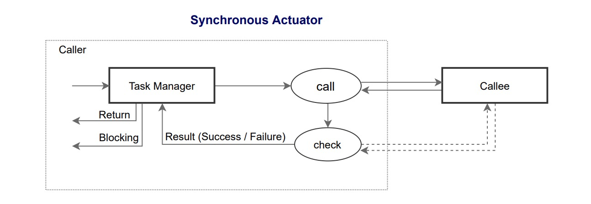
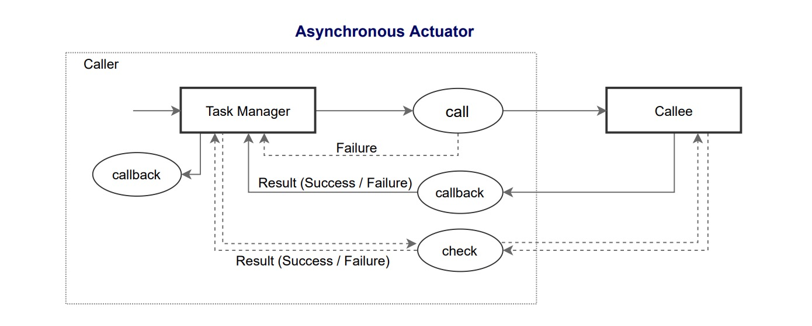
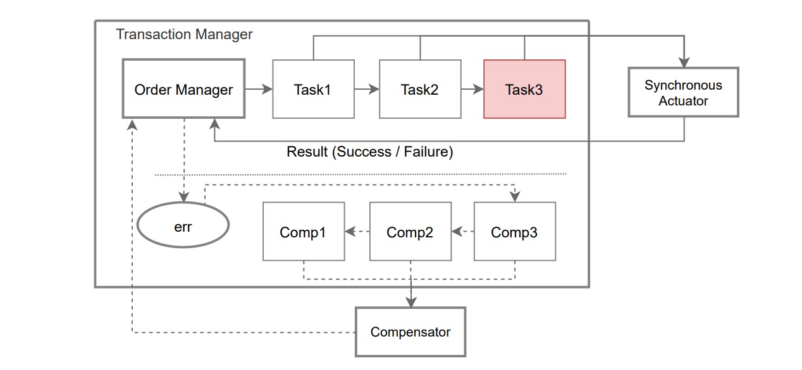
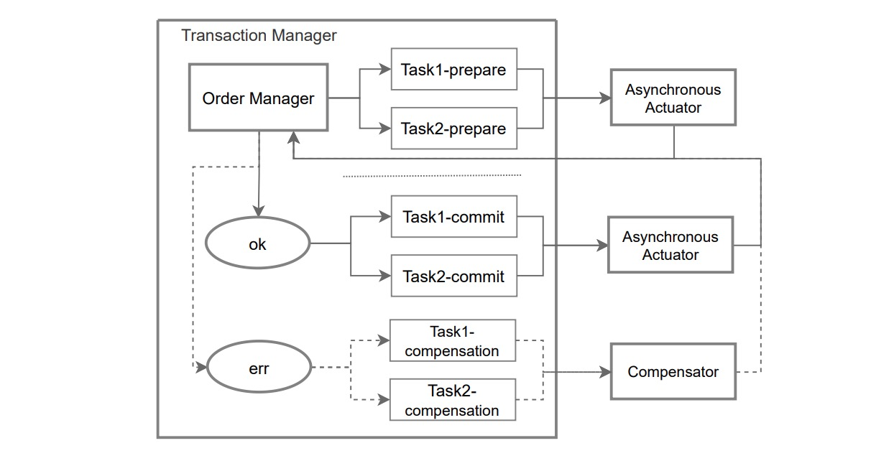

# ICTC 

## Abstract

IC Transaction Coordinator (ICTC) is a distributed transaction framework for Defi applications on IC network. It supports Motoko language. The core idea of ICTC is inspired by the DTC (Distributed Transaction Coordinator), which is commonly used in the financial sector.

## Motivation

Developing dapps based on IC networks, especially Defi applications, we have to face the problem of atomicity, which is essentially a data consistency problem for distributed transactions. The biggest challenge facing distributed transactions on blockchain networks compared to traditional distributed transactions is the different assumption of trust in the participating entities. While traditional distributed transactions are based on trustworthiness assumptions for participating entities, distributed transactions on blockchain networks are based on untrustworthiness assumptions for participating entities, and it only trusts smart contract code. 

When a method in Canister needs to execute a cross-container call, it will face the threat of inconsistent data due to a fault in the callee. Three types of faults may occur.

- Business error: e.g. insufficient token balance.
- Runtime error: e.g. divide-by-0 error.
- Fail-stop: e.g. the subnet where the callee is located is inaccessible.

The IC network is free from fail-stop most of the time, but there is still the potential for this type of failures to occur. If the Defi application cannot robustly handle failures and maintain eventual consistency, the consequences could be catastrophic. Imagine the following scenario.

    In a Dex canister, Alice, Bob exchange TokenA and TokenB, and the fee needs to be paid by Alice with TokenC, e.g.    
    TokenA.transferFrom(Alice, Bob, 100);  
    TokenB.transferFrom(Bob, Alice, 50);  
    TokenC.transferFrom(Alice, Dex, 1);  
    The three txns above form a transaction that requires either all of them to succeed or all of them to fail.    
    If the first txn above is successful and the second txn encounters a failure, the Dex contract will then need to  
    deal with the complex issues of checking whether the second txn was successful, whether to resend the second txn,   
    how to prevent duplicate txns from being sent, and whether to rollback the first txn. During these processes, new  
    questions will be encountered, such as: Does TokenA allow rollback? If rollback is allowed, what if the rollback  
    fails because Bob's balance has been transferred preemptively? If that failure happens to be a subnet fail-stop,  
    then the transaction will be blocked.

So we need a new framework that requires a concerted effort from both the caller and the callee to provide features that support the execution of distributed transactions. ICTC is based on [Base: An Acid Alternative](https://queue.acm.org/detail.cfm?id=1394128), and seeks eventual consistency of data in cross-canister transactions. Unfortunately, ICTC can only achieve "best-effort delivery" and requires governance compensation or manual compensation mechanisms as a final guarantee to achieve eventual consistency.

ICTC requires that each participant achieves.

- The callee achieves internal task atomicity
- The callee implements functionality to meet eventual consistency as appropriate, including
    - Allowing retries (requires idempotency)
    - Use Nonce (guarantees orderly execution of txns, idempotency)
    - Txid is globally unique and can be pre-calculated (txid can be calculated before sending a txn)
    - Provision of reversal transaction functions (rollback operations)
- Caller takes a variety of ways to achieve eventual consistency, including
    - Retries
    - Automatic reversal transaction
    - Governance or manual reversal transaction
- Debit first, credit later principle (receive first, freezable txn first)
- Caller-led principle (the caller acts as coordinator)

## Technology Architecture

ICTC consists of Transaction Manager (TM), Task Actuator (TA), and Transaction Compensator (TC).

Transaction Order: A transaction, including one or more transaction tasks, that requires all tasks to be either fully successful or fully rejected.   
Transaction Task: A task within a transaction, including local tasks of the caller and remote tasks of other parties involved.

## Task Actuator

The Task Actuator uses a "best-effort delivery" policy and will definitely return a result (success/failure). Synchronous actuator and asynchronous actuator are supported.

## Transaction Manager

The Transaction Manager is used to manage the status of transactions, operate the Actuator, handle exceptions and call the Compensator. Transaction Manager implementation includes the Saga Transaction Manager (SagaTM) and the 2PC Transaction Manager (TPCTM).

**Saga Transaction Manager**

**2PC Transaction Manager**

## Transaction Compensator

The Transaction Compensator function is implemented in Transaction Manager and is used to execute compensation operations when an exception occurs in a transaction, including automatic compensation, governance or manual compensation.

## Roadmap

- ICTC Framework PoC Version  (done)
- Synchronous Actuator  (done)
- Saga Transaction Manager  (done)
- ICTC Framework Alpha Version  (done)
- Asynchronous Actuator (doing)
- 2PC Transaction Manager
- ICTC Framework Beta Version
- ICTC Framework v1.0

## Community

Twitter: [@ICLighthouse](https://twitter.com/ICLighthouse)   
Medium: [https://medium.com/@ICLighthouse](https://medium.com/@ICLighthouse)  
Discord: [https://discord.gg/FQZFGGq7zv](https://discord.gg/FQZFGGq7zv)  